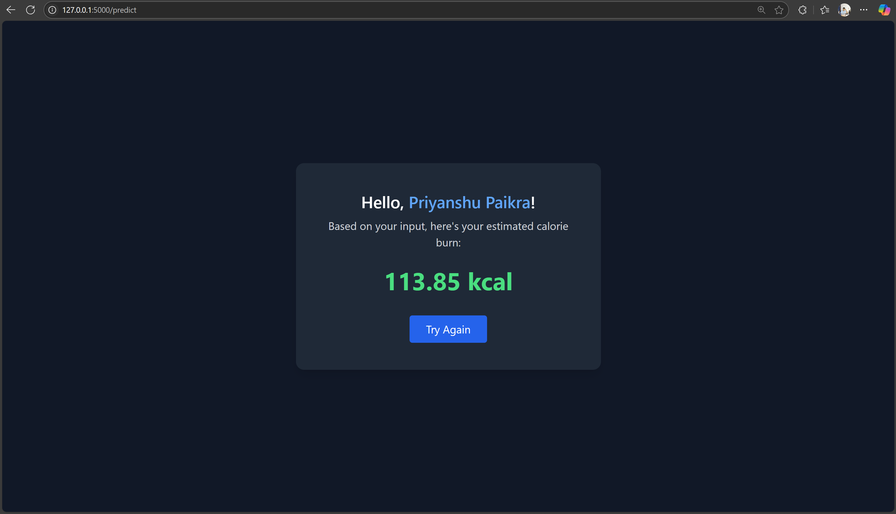

# 🔥 Calories Burnt Prediction App

A full-stack machine learning web application built with **Python**, **Flask**, and **Tailwind CSS** to predict the number of calories burned during physical exercise based on user inputs like gender, age, weight, height, duration, heart rate, and body temperature.

---

## 📸 Working Prototype


---

## 🚀 Features

- 🔐 User-friendly web interface
- 📊 Predicts calories burned based on scientific dataset
- ⚙️ Flask-based backend with ML model integration
- 🎨 Styled with Tailwind CSS for a clean, responsive UI
- 🔁 Real-time input/output handling
- 📁 Easy deployment and customization

---

## 🧠 Concepts Used

### 1. **Machine Learning**
- **Dataset**: Calories and exercise dataset containing features like Age, Height, Weight, Gender, Heart Rate, Body Temperature, and Duration.
- **Model**: Linear Regression or Random Forest Regressor (based on your implementation).
- **Training**: Model is trained on labeled data to learn the correlation between physical activity and calories burned.
- **Prediction**: Model infers calorie burn from unseen user input values.

### 2. **Flask (Python Web Framework)**
- **app.py**: Main backend logic for route handling and prediction serving.
- **Model Loading**: Uses `pickle` to load the pre-trained model.
- **Request Handling**: Receives POST requests with user input and returns prediction.

### 3. **Frontend (HTML + Tailwind CSS)**
- **Input Form**: Accepts all required features from the user.
- **Output Display**: Shows predicted calories burned in a styled result box.
- **Responsive Design**: Built with Tailwind utility classes for mobile-first experience.

### 4. **Data Processing**
- **Numerical Encoding**: Gender encoded as binary.
- **Feature Scaling**: Optional step to normalize data (depending on model type).
- **Input Validation**: Basic frontend form validation.

---

## 🛠️ File Structure

```bash
Calories_Burnt_Prediction/
├── dataset/
│   └── calories_data.csv
├── model/
│   └── calories_model.pkl
├── static/
|   ├── style.css
│   └── images/
│       └── prototype.png
|       └── result_sample.png
├── templates/
│   ├── index.html
│   └── result.html
├── app.py
├── calories.csv
├── exercise.csv
├── calories_model
├── calories.csv
├── train_model.ipynb
└── README.md
```

---

## 💻 How to Run Locally

### ✅ Prerequisites

- Python 3.7+
- pip
- Flask
- scikit-learn
- pandas
- Tailwind CDN (via HTML script)

### 📦 Setup Instructions

```bash
git clone https://github.com/<your-username>/calories_burnt_prediction_app.git
cd calories_burnt_prediction_app

# Create virtual environment (optional)
python -m venv venv
source venv/bin/activate  # On Windows: venv\Scripts\activate

# Install all the required libraries in your system
pip install <name of library>

# Install dependencies
pip install -r requirements.txt
```

### 🏃 Run the App

```bash
python app.py
```

Visit `http://127.0.0.1:5000` in your browser.

---

## 📥 Input Features

| Feature         | Description                         | Type     |
|----------------|-------------------------------------|----------|
| Gender          | Male / Female (encoded to 0/1)       | Categorical |
| Age             | Age of the user (in years)           | Numeric     |
| Height          | Height (in cm)                       | Numeric     |
| Weight          | Weight (in kg)                       | Numeric     |
| Duration        | Duration of exercise (in minutes)    | Numeric     |
| Heart Rate      | Average heart rate during exercise   | Numeric     |
| Body Temperature| Average body temperature (°C)        | Numeric     |

---

## 📤 Output

- **Calories Burned (kcal)** — Predicted value based on the ML model.

---

## 🔍 Example Screenshot



---

## 🙌 Credits

- Dataset: Calories Dataset From Kaggle
- Developed by: [Priyanshu Paikra](https://github.com/priyanshupaikra)


